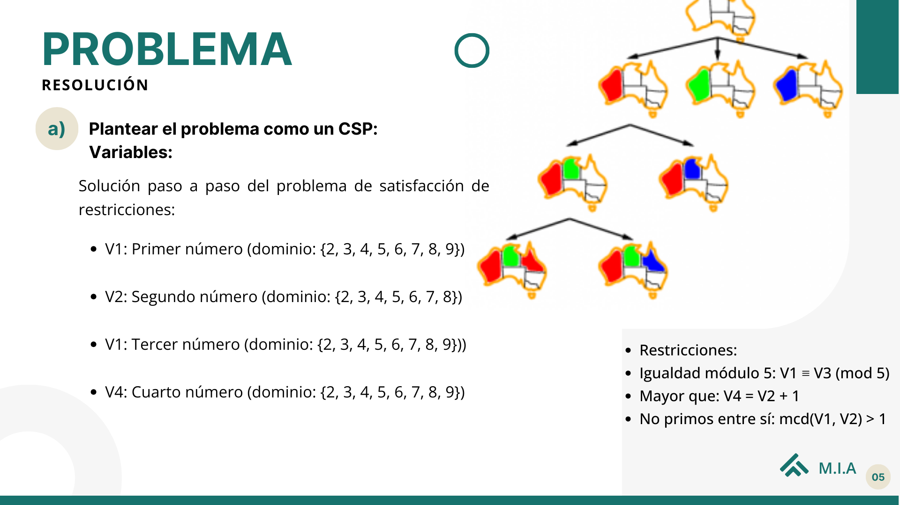
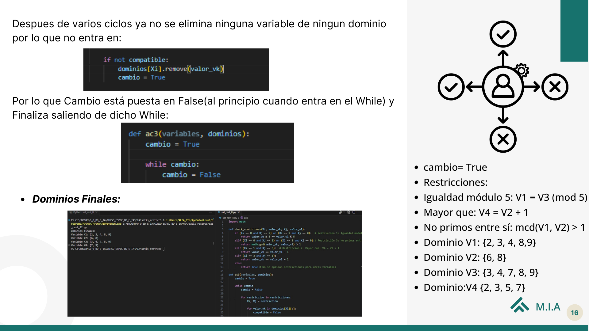

## Trabajo Sobre Algotimos del Módulo sobre Modelos de I.A. Satisfacción_de_restricciones

Se desea seleccionar cuatro números diferentes del 2 al 9 (ambos incluidos) que cumplan las siguientes condiciones: 

El primero y el tercero son iguales módulo 5. 
El cuarto es mayor que el segundo en una unidad 
El primero y el segundo no son primos entre sí. 

Se pide: 
a) plantear este problema como una satisfacción de restricciones. 
b) aplicar un procedimiento de consistencia en arcos par reducir los dominios.

## Enunciado del problema.

## Aquí hay un ejemplo del codigo, con los dominios finales:

## Documentación.
* [Documentación al proyecto](https://www.canva.com/design/DAF8R-DBvEs/ibfosnvF0cBu-OmEi8PMeA/view?utm_content=DAF8R-DBvEs&utm_campaign=designshare&utm_medium=link&utm_source=editor)

* [Problemas de Satisfacción de Restricciones](https://www.cs.us.es/~fsancho/Blog/posts/CSP.md)
* [Wikipedia](https://es.wikipedia.org/wiki/Problema_de_satisfacci%C3%B3n_de_restricciones)

