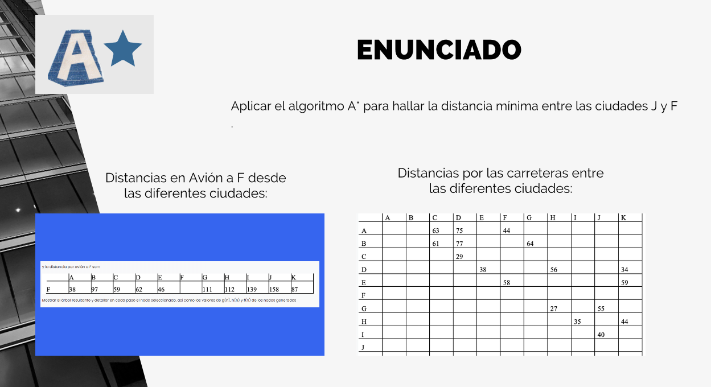

## Trabajo Sobre Algotimos del Módulo sobre Modelos de I.A.

Este código implementa el algoritmo A* para encontrar el camino más corto entre dos puntos en un gráfico, utilizando tanto el costo real para llegar a cada nodo (conocido como el costo g) como una heurística que estima el costo de llegar al nodo final desde un nodo dado (el costo h). La suma de estos dos costos se conoce como el costo f.

## Enunciado del problema.

El código define dos diccionarios: distancias, que contiene las distancias entre los nodos, y heuristica_avion, que contiene las estimaciones heurísticas de la distancia al nodo objetivo F desde cada nodo.

La función a_star es la implementación del algoritmo A*. Inicia con el conjunto abierto open_set que contiene el nodo de inicio con un costo estimado de 0. El closed_set es un conjunto que almacenará los nodos ya evaluados.

La función utiliza dos diccionarios, g_score y f_score, para llevar la cuenta de los costos actuales y estimados, respectivamente. Inicialmente, todos los nodos tienen un costo infinito, excepto el nodo de inicio.

El bucle principal continúa mientras haya nodos en open_set. Selecciona el nodo con el menor costo f y lo evalúa. Si el nodo actual es el destino, reconstruye el camino utilizando la función reconstruct_path y lo devuelve.

Si no es el destino, el algoritmo actualiza los costos de los vecinos del nodo actual y los agrega al open_set si no están en el closed_set y si el nuevo camino es mejor que cualquier camino previo encontrado.

La función reconstruct_path construye el camino recorriendo hacia atrás desde el nodo destino hasta el nodo de inicio, utilizando el diccionario came_from que mantiene un registro de cómo se llegó a cada nodo.

Finalmente, la función draw_graph utiliza la biblioteca networkx para dibujar el gráfico y resaltar el camino encontrado. Utiliza matplotlib para mostrar el gráfico.

Aquí hay un ejemplo de cómo podría verse un gráfico simple con los nodos y caminos:

