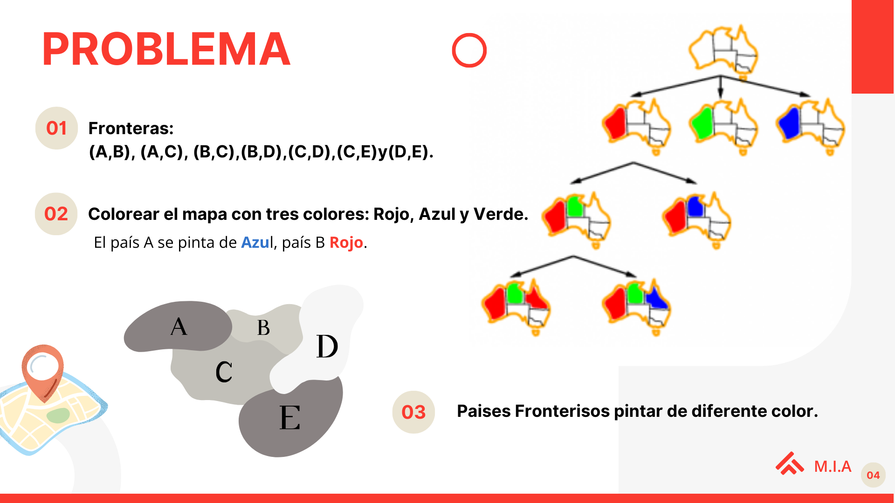
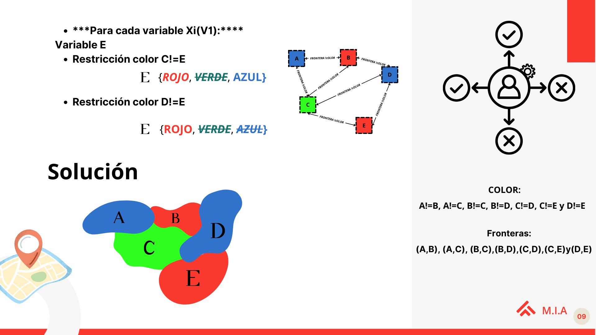

## Trabajo Sobre Algotimos del Módulo sobre Modelos de I.A. Colorear Mapas
Sea un mapa con los países A,B,C,D y E. Las fronteras entre los países son : (A,B), (A,C), (B,C),(B,D),(C,D),(C,E)y(D,E).

Colorear el mapa con tres colores: Rojo, Azul y Verde. El país A se pinta de Azul, país B Rojo. ¿Existe alguna asignación de que cumpla esas condiciones y no pinte del mismo color dos países fronterizos?

a) Formalizar el problema con satisfacción de restricciones

b)Grafo de Restricciones

c)Aplicar el algoritmo de consistencia en arcos

## Enunciado del problema.

# Aquí hay un ejemplo de la implementacion del código, con los dominios finales:
## Zona para las restricciones y para la lógica de resolución del problema.

# Aquí hay un ejemplo del codigo, con los dominios finales:

## Documentación.
* [Documentación al proyecto](https://www.canva.com/design/DAF8R-DBvEs/ibfosnvF0cBu-OmEi8PMeA/view?utm_content=DAF8R-DBvEs&utm_campaign=designshare&utm_medium=link&utm_source=editor)

* [Problemas de Satisfacción de Restricciones](https://www.cs.us.es/~fsancho/Blog/posts/CSP.md)
* [Wikipedia](https://es.wikipedia.org/wiki/Problema_de_satisfacci%C3%B3n_de_restricciones)

